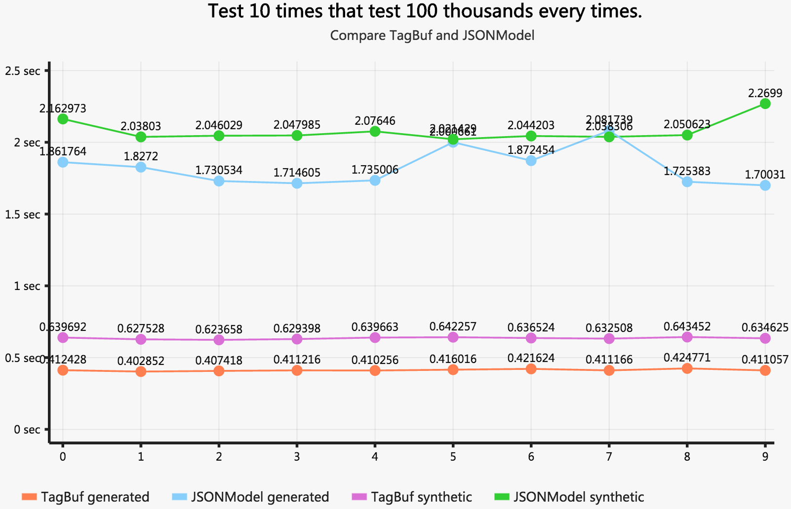

# TagBuf - Implementation In Objective-C
TagBuf is implemented by C++ and Objective-C. And use inline template to serialize data to improve executed speed.

> Especially, all of string's encode type is UTF8. If not, there will be a error in string generated or synthetic.

## Usage
- Copy Directory 'TagBuf' to your project.
- Import file 'tagBuf.h'.

There has two ways to create a class which can be Distinguished by TagBuf.
- Inherits class CHTagBuffer. These class which inherits CHTagBuffer use common CHTagBufferBuilder instance. So it is non-thread-safe. However, because of common use, the performance is better.
- Inherits NSObject. These class which inherits NSObject has own CHTagBufferBuilder instance.

Whether it is inherited from CHTagBuffer, or inherited from NSObject. You can also invoke `- (NSData *)toTagBuffer;` or `+ (instancetype)objectWithTagBuffer:(NSData *)tagBuffer;`. These methods are non-thread-safe.

### Example
- For object. Every object is required by default, That is, If object is nil, TagBuf will throw exception.
- For container object. You can modify protocol to property to indicate contained type. If you don't modify it, TagBuf will try to find contained type in runtime. If finds failed, you will receive exception or cause parsing failed.
> There has some builtin contained type:
> - NSNumberInt32. contains NSNumber which indicates 32 bits integer.
> - NSNumberInt64. contains NSNumber which indicates 64 bits integer.
> - NSNumberBoolean. contains NSNumber which indicates bool value.
> - NSNumberInt8. contains NSNumber which indicates 8 bits integer.
> - NSNumberInt16. contains NSNumber which indicates 16 bits integer.
> - NSNumberFloat. contains NSNumber which indicates 32 bits float.
> - NSNumberDouble. contains NSNumber which indicates 64 bits double.
> - NSArrayNSData. contains object which indicates NSData object.
> - NSArrayNSString. contains object which indicates NSString object.
> - NSArrayNSArray. contains object which indicates NSArray object.
> Especially, if contains NSNumber and you haven't modified property, it is NSNumberInt32 by default.

- For Other object contained. You must declare protocol named the same as the object. And use the protocol to modify the property.

```Objective-C
#import "tagBuf.h"

@protocol OtherClassName
@end

@interface CHExampleModel : CHTagBuffer

@property (nonatomic) NSUInteger name;
@property (nonatomic) double prority;
@property (nonatomic) short number;
@property (nonatomic) bool opened;

@property (nonatomic, strong) NSString *str100Length;
@property (nonatomic, strong) NSArray *_10StringContent; // Its contained type will be find in runtime.

@property (nonatomic, strong) NSArray<ignore> *ignoreProperty; // This property will be ignore. Even though the property has a value.
@property (nonatomic, strong) NSString<optional> *optionalProperty; // This property will not be parsed if its value is nil.
@property (nonatomic, strong) NSArray<OtherClassName> *array; // Contains object that its class is 'OtherClassName'.
@property (nonatomic, strong) NSArray<ignore, NSNumberInt32> *MultiProperty; // Also exists kinds of protocol.
@end
```

```Objective-C
@implementation CHExampleModel
@end
```

# Performance - Compared To JSONModel
We made a class - `CHPerformanceTestModel` and fill some data to its objects.

```Objective-C
- (void)fillTestData
{
    self.name = 0x23546;
    self.prority = 5346.65473;
    self.number = 35;
    self.opened = true;
    NSMutableString *str = [NSMutableString stringWithCapacity:100];
    int i=100;
    while (i-->0) {
        [str appendString:@"1"];
    }
    self.str100Length = str;

    self._10StringContent = @[str,str,str,str,str,str,str,str,str,str];
}
```
- It is 1220 bytes data by TagBuf generated.
- It is 1231 bytes data by JSONModel generated.

## Performance Show
We test the generated buf/string and synthetic object 1 million times. Below is data table.

||Generated(avg)|Synthetic(avg)|
|---|---|---|
|TagBuf|4.11sec|6.35sec|
|JSONModel|18.25sec|20.80sec|


We test 10 times that test 100 thousands every times.

||0|1|2|3|4|5|6|7|8|9|
|---|---|---|---|---|---|---|---|---|---|---|
|TagBuf generated|0.412428|0.402852|0.407418|0.411216|0.410256|0.416016|0.421624|0.411166|0.424771|0.411057|
|TagBuf synthetic|0.639692|0.627528|0.623658|0.629398|0.639663|0.642257|0.636524|0.632508|0.643452|0.634625|
|JSONModel generated|1.861764|1.827200|1.730534|1.714605|1.735006|2.000661|1.872454|2.081739|1.725383|1.700310|
|JSONModel synthetic|2.162973|2.038030|2.046029|2.047985|2.076460|2.021429|2.044203|2.038306|2.050623|2.269900|

